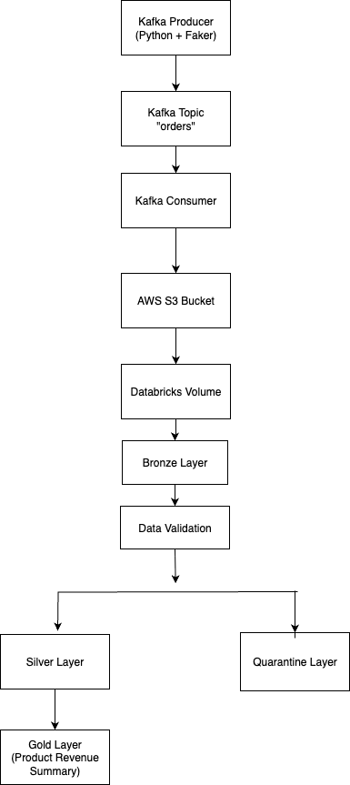

# Kafka-S3-Databricks Medallion Architecture

## Project Overview

This project demonstrates an end-to-end Data Engineering pipeline using Apache Kafka, AWS S3, PySpark, and Databricks following the Medallion Architecture (Bronze, Silver, Gold).

The pipeline ingests streaming order data from Kafka, stores raw data in AWS S3, processes it in Databricks, applies data quality validations, separates invalid records into a quarantine layer, and generates business-ready aggregated data in the Gold layer.

---

## Architecture



---

## Technology Stack

- Apache Kafka
- Python
- Faker
- AWS S3
- Databricks
- PySpark
- Delta Lake
- SQL

---

## Data Flow

1. Kafka Producer generates order events using Faker.
2. Events are published to Kafka Topic (`orders`).
3. Kafka Consumer reads messages from Kafka.
4. Data is stored in AWS S3.
5. Databricks ingests raw JSON data from S3.
6. Raw data is stored in the Bronze Layer.
7. Data Quality Validation rules are applied.
8. Invalid records are moved to the Quarantine Layer.
9. Valid records are promoted to the Silver Layer.
10. Business aggregations are created in the Gold Layer.

---

## Medallion Architecture

### Bronze Layer

Stores raw ingested data without transformations.

**Records Processed:** 188

---

### Data Quality Validation

Validation Rules:

- order_id should not be null
- customer_name should not be null
- amount should be greater than 0
- payment_status should not be UNKNOWN

---

### Quarantine Layer

Stores records that fail validation rules.

**Records:** 160

---

### Silver Layer

Stores clean and validated records.

**Records:** 28

---

### Gold Layer

Contains business-ready aggregated datasets.

Example:

- Product Revenue Summary

| Product | Revenue |
|----------|----------|
| Laptop | 253189 |
| Phone | 165416 |
| Mouse | 153327 |
| Keyboard | 130595 |
| Monitor | 29159 |

---

## Repository Structure

```text
.
├── producer.py
├── consumer_save.py
├── spark_consumer.py
├── docker-compose.yml
├── databricks/
│   └── medallion_architecture_pipeline.ipynb
└── architecture/
    └── architecture.png
```

---

## Results

| Layer | Record Count |
|---------|---------|
| Bronze | 188 |
| Quarantine | 160 |
| Silver | 28 |

---

## Future Enhancements

- Real-time Spark Structured Streaming
- Automated orchestration using Airflow
- Data quality monitoring
- Dashboarding using Power BI or Tableau
- CI/CD integration using GitHub Actions

---

